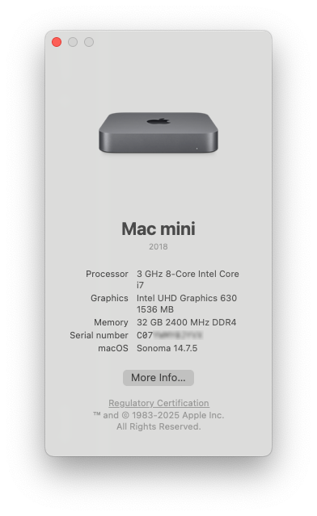
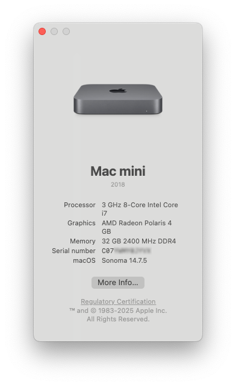

# Dell Optiplex 7060/7070 Cross-Compatibility Notes

<div align="center">


</div>

> [!NOTE]
> This document covers cross-compatibility between different Dell Optiplex models and additional GPU configuration information that goes beyond the standard 7050 setup described in the main README. I wanted to see if a simple Sabrent SSD swap to a 7060 and 7070 would work and to my surprise it just booted right up after disabling CFG Lock and slightly adjusting the BIOS, so wanted to document my findings here. I wouldn't be surprised if the Optiplex 7040 would also boot with my EFI.

## 🔄 Cross-Generation Compatibility

I've loosely tested the EFI configuration across multiple Optiplex generations and it surprisingly worked. Makes sense how Intel and Dell didn't change much in those generations years ago before AMD turned up the heat. Here's the compatibility:

- ✅ **Optiplex 7050** (7th Gen Intel) - Primary target
- ✅ **Optiplex 7060** (8th Gen Intel) - Works with identical EFI
- ✅ **Optiplex 7070** (9th Gen Intel) - Works with identical EFI

Transferring the Sabrent SSD with macOS between systems worked without reinstallation. After changing BIOS settings to kind of match the 7050 configuration and disabling CFG Lock with the included tool, all systems booted without obvious issues.

Hackintool correctly detects the different PCIe devices across different generations, confirming proper hardware recognition.

> [!IMPORTANT]
> While the Optiplex 7060 and Optiplex 7070 do successfully boot to desktop, I don't know if something under the hood is not working or broken. As far as I can see with my testing, it looks like everything should be working exactly the same as on the Optiplex 7050. Let me know if you find something else though!

Here's About my Mac showing the 8-Core i7-9700 and its exactly the same OS, just the SSD was moved over:

<p align="center">
  
</p>

## 🎮 Dell OEM AMD RX 640 Support

> [!NOTE]
> The Dell OEM AMD RX 640 GPU (with Lexa cores) works perfectly with a simple DeviceProperties modification. I left it in the config since version 1.0.4, because it doesn't look like it causes issues if you don't have an AMD GPU in and you boot from the iGPU. This most likely will cause issues if you have a different AMD GPU in like an RX 6600. Please remove the "PciRoot(0x0)/Pci(0x1,0x0)/Pci(0x0,0x0)" entry from DeviceProperties and replace it with something that works for your GPU from this list: [Dortania GPU Buyer's Guide](https://dortania.github.io/GPU-Buyers-Guide/). The Raw Property List data for this is below:

```xml
<key>PciRoot(0x0)/Pci(0x1,0x0)/Pci(0x0,0x0)</key>
<dict>
    <key>device-id</key>
    <data>/2c=</data>
</dict>
```

With this modification:

- ✅ Hotplug works correctly (7060 and 7070)
- ✅ Sleep functions properly with both Intel iGPU (UHD 630) and AMD GPU (Only on 7060 and 7070)
- ✅ Multiple display outputs function as expected (7050, 7060 and 7070)

Here's About my Mac showing the AMD GPU working and it genuinely does, tested some games and it runs performant like it would on Windows:

<p align="center">
  
</p>

## 🖥️ Multi-Monitor & GPU Behavior

GPU activation depends on which display is connected at boot time:

- If you boot using only the AMD GPU connected, the iGPU won't activate later
- For multi-monitor mode with both GPUs, connect to the AMD GPU during OpenCore boot menu, then plug in the iGPU before entering macOS
- Both GPUs can be used simultaneously once properly activated at boot

While not the most seamless experience, this approach successfully enables multi-monitor configurations across both GPUs.

## 💤 Sleep/Wake Differences

Sleep/wake functionality varies between CPU generations:

- ❌ **7th Gen (7050)**: Unreliable sleep/wake behavior, I only saw it wake up two (2) times via HDMI
- ✅ **8th Gen (7060)**: Working sleep/wake
- ✅ **9th Gen (7070)**: Working sleep/wake

Unfortunately for us with Optiplex 7050, Wake is still not working. Maybe there is a DeviceProperty for the GPU that makes this work, but as it currently stands, we don't have Wake support. It goes to Sleep just fine.

This difference likely relates to the transition from Intel **HD** 630 to **UHD** 630 graphics between generations. Based on comical research, 6th and 7th gen Intel CPUs have consistently shown sleep reliability issues in Hackintosh configurations.

Source: Trust me bro.

## 📡 macOS Sequoia Networking

Sequoia just broke everything for us using Intel WiFi:

- ✅ Ethernet works normally
- ❌ Broadcom WiFi support was removed in Sonoma
- ❌ Intel WiFi (itlwm) broken in Sequoia due to networking stack rewrites

For Sequoia installations:

1. Disable AirportItlwm kexts in OpenCore Configurator
2. Use Ethernet for network connectivity
3. iServices should work properly over Ethernet

For other macOS versions:

- **Sonoma**: Use Intel WiFi with appropriate kexts
- **Ventura and earlier**: Compatible with Broadcom WiFi cards (DW1560, DW1820A)

For those wanting WiFi in Sequoia, unofficial solutions exist through OpenCore Legacy Patcher to fix Broadcom or use a hacked Itlwm kext (not recommended). This might eventually be fixed, given enough time.

> [!TIP]
> Just look at these poor souls on this [itlwm issue](https://github.com/OpenIntelWireless/itlwm/issues/1009) crying for help.
