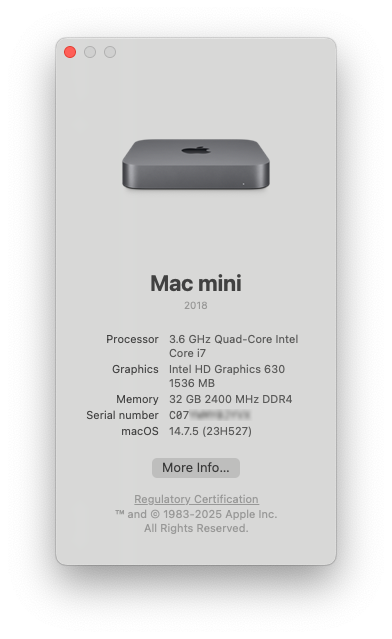

Hi, This is my hackitosh using the 7050 SFF!
There's some hardware changes and minimal plist edits as well some kext changes.
I was running Ventura for awhile but have moved on to Sequia.
Wifi and Bluetooth both work using itlwm, if you want native on Sequia you can use AirportItlwm but with spoofing(too lazy to mess with)!
MY HARDWARE
CPU: i7-6700
GPU: AMD RX 550(Polaris)
WIFI: Intel 8260NGW
STORAGE: WD BLUE SA510

Added Kexts:
Itlwn - changed for Sequoia support
HoRNDIS - For Android 
New USB Map

Opencore Version is still 1.0.4, if the main branch is updated to newer version ill probably update, but as of now everything works fine.


-# There would be an image here showing the Optiplex but my desk is to mess :(((

This probably still works for MFF and all the other it was compatible for, just make sure to change the USBMap kext for one that matches your device

Sleep and Wake work! Wifi and Bluetooth sometimes get stuck after waking, just make sure to turn BOTH Wifi & Bluetooth off before turning them back on again.

The rest of this guide should work! Thank you linkev!! 


<div align="center">
--------------------------------------
</div?


 Dell Optiplex 7050 Micro/SFF/MT Hackintosh - OpenCore 1.0.4


<div align="center">


</div>

<p align="center">
  
</p>

> [!NOTE]
> This repository contains my personal EFI configuration for the Dell Optiplex 7050 Micro, but it also works great on the bigger Small Form Factor (SFF) and even bigger Mini Tower (MT) version!

> [!IMPORTANT]
> If you are using an AMD/NVIDIA GPU, please remove the "PciRoot(0x0)/Pci(0x1,0x0)/Pci(0x0,0x0)" entry from DeviceProperties in config.plist before proceeding. This is in the config right now to support my RX 640 by masking it to be an RX 550. If you are ONLY using the iGPU, you can ignore this message. [More information about this here!](OPTIPLEX-7060-7070-COMPATIBILITY.md#-dell-oem-amd-rx-640-support)

> [!TIP]
> While this is tailored specifically for the Optiplex 7050 (Intel 7th gen), this exact same config also seems to work as a good starting point on the Optiplex 7060 (Intel 8th gen) and Optiplex 7070 (Intel 9th gen) variants, it boots right into macOS. [If you're interested, I talk more about this here!](OPTIPLEX-7060-7070-COMPATIBILITY.md)

## ⚡ Quick Start

If you want to get up and running as soon as possible and don't have time to read, follow these steps:

1. Download the repository either via `git clone https://github.com/linkev/Dell-Optiplex-7050-Micro-Hackintosh.git` or via [Releases](https://github.com/linkev/Dell-Optiplex-7050-Micro-Hackintosh/releases)
2. Make sure to generate and fill in the config.plist with your SMBIOS using [GenSMBIOS](https://github.com/corpnewt/GenSMBIOS)
3. Use [Mist](https://github.com/ninxsoft/Mist) on an Intel Mac to get the .app installer or follow the [Dortania Creating the USB guide](https://dortania.github.io/OpenCore-Install-Guide/installer-guide/) to get a proper macOS installer
4. Mount the EFI partition of your USB and copy over the EFI folder
5. Modify your BIOS on your Dell Optiplex according to the [BIOS.md](BIOS.md) file
6. Boot OpenCore from the USB you prepared and use the "Check CFG" and "Modify CFG" tools to unlock your CFG (or use the "AppleCpuPmCfgLock" and "AppleXcpmCfgLock" Kernel quirks in the config.plist) and restart to apply the changes
7. Boot OpenCore again and select "Install macOS (your downloaded macOS version)"
8. If you did everything correctly, you should arrive at the installer screen. Choose "Disk Utility", make sure you click the icon in the top left and choose "Show All Devices" and format the drive itself for APFS, not the Volumes as it shows those by default
9. Close "Disk Utility" and start the "macOS Installer". Follow the steps like you would install a normal Mac
10. Multiple reboots later, you should get the "First Time Setup" screen
11. Congratulations! You now have a Dell Optiplex Hackintosh. Please do the usual [OpenCore Post-Install](https://dortania.github.io/OpenCore-Post-Install/) steps so you don't have to boot off the USB. Just copy the EFI to your actual SSD

Otherwise, continue reading!

## 🚀 Overview

I am currently dual-booting **macOS Sonoma 14.7.5 (23H527)** with [OpenCore](https://github.com/acidanthera/OpenCorePkg) 1.0.4 and **Windows 11 24H2** on the same Sabrent drive with macOS on a 448GB partition and Windows on a 64GB partition. Easy to switch between both OSes by pointing to their respective .efi bootloaders in the BIOS and manually making the Boot Entries. Do not boot into Windows via OpenCore! It will inject macOS stuff and Windows gets confused. If you are dual-booting, keep these separate by using the Windows Bootloader and macOS Bootloader separately, as you can see in the demo video below. I aim to have as clean of configuration as possible, and so far everything has been working great.

This build was initially set up with Dell BIOS 1.14.0 and has been successfully updated through 1.15.1, 1.15.2, and is currently running perfectly on 1.24.0.

This build has been tested with these macOS versions:

| macOS Version | Status | Notes |
|---------------|:------:|-------|
| ✅ **Sequoia** | Supported | Cannot use Intel WiFi (disable AirportItlwm kexts). Only Ethernet is available. |
| ✅ **Sonoma** | Recommended | Best with Intel WiFi card and kexts |
| ✅ **Ventura** | Recommended | Best with native Broadcom WiFi card and kexts |
| ✅ **Monterey** | Supported | Works with Broadcom cards |
| ✅ **Big Sur** | Supported | Works with Broadcom cards |
| ✅ **Catalina** | Supported | Works with Broadcom cards |
| ✅ **Mojave** | Supported | Works with Broadcom cards |

I use **Macmini8,1** as my SMBIOS. **iMac18,1** is also a good alternative, depending on what you want it to show up as (have used both with no issues). The Macmini 2018 SMBIOS seems to be the best one, it works on the 7050, 7060 and 7070 and detects the memory slot numbers correctly too. The Macmini has 2, but a bigger 7070 shows the 4 slots and how many are populated. Useless information, but hey it's neat that it works!

This is what the final product should look like, the entire boot process from start to finish. If you're not dualbooting then you can ignore the "Windows Boot Manager" and "macOS Boot Manager" part of the video:

https://github.com/linkev/Dell-Optiplex-7050-Micro-Hackintosh/assets/13016565/637bbedf-527e-4ffb-9a30-4245c1ddc71c

## 📋 Table of Contents

- [Hardware Specifications](#-hardware-specifications)
- [Compatibility Status](#-compatibility-status)
- [Getting Started](#-getting-started)
- [Preparation](#-preparation)
- [BIOS Settings](#%EF%B8%8F-bios-settings)
- [Creating Bootable USB](#-creating-bootable-usb)
- [First Boot & UEFI Configuration](#-first-boot--uefi-configuration)
- [Installation](#-installation)
- [Post-Installation](#-post-installation)
- [Sonoma and Sequoia WiFi Notes](#-sonoma-and-sequoia-wifi-notes)
- [Troubleshooting](#%EF%B8%8F-troubleshooting)
- [Gallery](#-gallery)
- [References & Credits](#-references--credits)

## 💻 Hardware Specifications

<p align="center">
  
</p>

| Component | Details |
|-----------|---------|
| CPU | Intel i7-7700 |
| RAM | 32GB Samsung DDR4 @ 2400 MHz |
| Graphics | Intel HD Graphics 630 1536 MB |
| Storage | Sabrent Rocket 512GB NVMe + Samsung 860 QVO 1TB SATA |
| Wireless | Intel® Wireless-AC 9260 WiFi 5 + Bluetooth 5.1 |
| Ethernet | Intel I219-LM Gigabit |
| Audio | Integrated speaker (front) + Headphone/Mic jacks and Line Out |
| Display Ports | 1× DisplayPort 1.2 + 1× HDMI 1.4 + 1× Addon DP (Works if you boot from it) |
| USB Ports | 1× USB-C + 1× USB-A (front), 4× USB-A (back) |
| PSU | 130 watt Dell power supply |

## ✅ Compatibility Status

### Working

- ✅ APFS
- ✅ CPU power management
- ✅ GPU acceleration & hardware video encoding/decoding
- ✅ All USB ports at their max speed (No USBMap needed)
- ✅ Gigabit Ethernet
- ✅ Secure Boot (SIP)
- ✅ WiFi and Bluetooth
- ✅ Location Services
- ✅ Onboard Audio & integrated speaker (`alcid=11`)
- ✅ iMessage & iCloud services (with proper ROM/MLB/Serial)
- ✅ App Store & FaceTime
- ✅ Handoff & AirPlay
- ✅ Continuity & Continuity Camera via USB
- ✅ DRM support (iTunes, Netflix, Amazon Prime, Apple TV+)
- ✅ NVRAM & FileVault
- ✅ Dell Sensors (Fans/Temperature via [exelban Stats](https://github.com/exelban/stats))
- ✅ DisplayPort 1.2 and HDMI 1.4 outputs and the optional addon port, mine is DisplayPort, but VGA/HDMI might be on others
- ✅ TRIM support (NVMe native, SATA via `sudo trimforce enable`)
- ✅ Sidecar & Content Caching
- ✅ Time Machine
- ✅ Seamless software updates (via [RestrictEvents](https://github.com/acidanthera/RestrictEvents))

### Not Working

- ❌ Sleep/Wake (the Optiplex sleeps fine, but display doesn't come back on Wake)

> [!NOTE]
> While this is broken for Intel 6th and 7th Gen, ironically Sleep/Wake works flawlessly with Optiplex 7060 (8th Gen) and 7070 (9th Gen) with this same configuration. Just boot it and see for yourself. I'm assuming it's something to do with the iGPU. Something between the HD 630 and UHD 630 changed to sort this out. If you find a solution, please raise an issue and let me know!

- ❌ Headless mode (booting without a monitor)

> [!NOTE]
> Use a Dummy DisplayPort or a HDMI plug to "activate" the GPU and then you can use something like Parsec or TeamViewer to remote control it.

- ❌ AirDrop (it worked with native Broadcom WiFi card, until Sonoma broke it)
- ❌ Unlock with Apple Watch (lost in Sonoma)
- ❌ AirPlay to Mac (worked in Monterey, but not Sonoma)

## 🚀 Getting Started

> [!IMPORTANT]
> **You MUST add your own System Serial Number, System UUID, MLB and ROM in PlatformInfo before booting!**

1. Download the latest EFI package from [Releases](https://github.com/linkev/Dell-Optiplex-7050-Micro-Hackintosh/releases) or clone this repository
2. Open the config.plist with [OpenCore Configurator](https://mackie100projects.altervista.org/download-opencore-configurator/). While OpenCore Configurator is recommended for its ease of use, you can also use tools like [Xcode](https://apps.apple.com/us/app/xcode/id497799835) or [ProperTree](https://github.com/corpnewt/ProperTree) if you prefer
3. Navigate to PlatformInfo → DataHub - Generic - PlatformNVRAM
4. Fill in the highlighted fields:

<p align="center">
  
</p>

- **System Serial Number**: Generate with [GenSMBIOS](https://github.com/corpnewt/GenSMBIOS)
- **System UUID**: Generate with [GenSMBIOS](https://github.com/corpnewt/GenSMBIOS)
- **MLB**: Generate with [GenSMBIOS](https://github.com/corpnewt/GenSMBIOS)
- **ROM**: Use your Ethernet/WiFi MAC address (e.g., `E4:85:G6:M8:H9:2Q`)

You can attach the config.plist in GenSMBIOS so it automatically fills the correct sections when you generate your SMBIOS. Make sure your **System Serial Number** shows up as invalid serial! When inputting your serial number in [Apple's Check Coverage Page](https://checkcoverage.apple.com/), you should get a message such as "Unable to check coverage for this serial number". For more detailed instructions, refer to the [Dortania OpenCore Guide](https://dortania.github.io/OpenCore-Install-Guide/).

## 📝 NVRAM Values

The following boot arguments are used:

- `-alcid=11` - Required for audio (Headphone Jack/Line Out & Internal Speaker)
- `igfxonln=1` - Forces display/GPU activation (helpful when booting without a display)
- `revpatch=sbvmm` - Enables seamless macOS updates with [RestrictEvents](https://github.com/acidanthera/RestrictEvents)
- `igfxrpsc=1` - Added in repo version 1.0.4 to "Enable RPS control patch". Apparently it improves GPU performance as per [WhateverGreen's README](https://github.com/acidanthera/WhateverGreen)

> [!TIP]
> Add `-v` to boot args for verbose mode if you need to troubleshoot boot issues. I've omitted this, because I've reinstalled macOS successfully so many times that I don't need it anymore.

## 🔧 Preparation

> [!WARNING]
> **Always backup important data before proceeding!**

1. **Update BIOS to latest version**
   - Latest tested version: [1.24.0](https://www.dell.com/support/home/en-uk/drivers/driversdetails?driverid=hy8pf&oscode=wt64a&productcode=optiplex-7050-desktop)
   - Reset to Factory Defaults after updating

2. **Disable CFG Lock**
   - This can be done using the provided tools in OpenCore, just choose "Unlock CFG", it should find the bit and ask you to flip it, just type "Y" and enter
   - Alternatively, enable AppleCpuPmCfgLock and AppleXcpmCfgLock in Kernel section (less optimal for performance)

3. **Storage Compatibility**
   - ✅ Sabrent SSDs work very well, the Phison controller is well supported
   - ✅ ADATA SSDs reported to be working by [AshkanAbd](https://github.com/linkev/Dell-Optiplex-7050-Micro-Hackintosh/issues/20#issuecomment-2132219453)
   - ❌ Samsung PM drives often crash during installation
   - ❌ Toshiba drives also don't work, these usually come with XPS/Optiplex
     - May be fixable with NVMEFix.kext

4. **WiFi Card Considerations**
   - Currently the repo is on Intel WiFi, so you will need to remove the Intel kexts and use Broadcom Kexts if you're installing an older macOS version and using a Broadcom card
   - For Big Sur through Ventura with Broadcom cards (DW1560/1820A), modify config according to [AirportBrcmFixup documentation](https://github.com/acidanthera/AirportBrcmFixup#please-pay-attention)
   - Add `brcmfx-country=#a` if using Broadcom WiFi

## 🖥️ BIOS Settings

For full BIOS configuration details, see [BIOS.md](BIOS.md)

Key settings:

- **General**: UEFI boot, disable legacy options
- **Video**: Set primary display to Intel HD Graphics or Auto if you're using AMD GPU's (maybe a GTX 1080?!)
- **Security**: Enable CPU XD Support (critical!)
- **Secure Boot**: Disable
- **Performance**: Enable all CPU features (multi-core, SpeedStep, C-states, TurboBoost, HyperThread)
- **Virtualization**: Enable Virtualization, enable VT for Direct I/O
- **POST Behavior**: Set Fastboot to Thorough

## 💾 Creating Bootable USB

> [!CAUTION]
> Do not use an Apple Silicon Mac (M1/M2/M3/M4/M5/M6/M7/M8/M9/M10 and so on...) to download the installer. They download ARM64 installers, not x86_64/AMD64 that we need.

### Method 1: Using Official Guide

Follow the [OpenCore Installation Guide](https://dortania.github.io/OpenCore-Install-Guide/installer-guide/)

### Method 2: Using an existing Intel Mac

1. Download [Mist](https://github.com/ninxsoft/Mist) to get the full installer
2. Format a USB drive as Mac OS Extended (Journaled) named "USB"
3. Run the following command in Terminal:

```bash
sudo /Applications/Install\ macOS\ Sonoma.app/Contents/Resources/createinstallmedia --volume /Volumes/USB
```

> [!NOTE]
> You will have to edit the install command depending on what macOS you downloaded and what the USB is named. Usually you just write `sudo` in a Terminal, space, drag and drop the createinstallmedia script from within whatever "Install macOS (version name).app" file you downloaded, then append `--volume /Volumes/USB` and press enter. XProtect might be scanning the .app file, so wait for the Terminal to ask for your sudo password, enter it and type Y. I recommend an NVME or SATA SSD to install to as it's much faster than a USB to write and install macOS from.

Mount the USB's EFI partition via the OpenCore Configurator icon in the menu bar and copy the modified OpenCore EFI folder into it. You should now have a bootable Hackintosh Macintosh Installer!

## 🔑 First Boot & UEFI Configuration

Boot from the USB by pressing F12 during startup. This is the final product boot menu, your version will have extra entries like your USB, no Windows entry etc. Don't select the "Install macOS (Sequoia, Sonoma etc)" option yet, we need to change our hidden BIOS options first.

<p align="center">
  
</p>

Here's a quick rundown of what some common OpenCore boot menu options mean:

**macOS (or Install macOS...)**: Boots into your macOS installation or the installer
**Recovery**: Boots the Recovery partition, useful for repairs or disabling SIP, similar to a real Mac
**Check CFG**: Reports the current status of the CFG Lock (MSR 0xE2 register)
**Unlock CFG**: A tool to find the CFG Lock bit and allow you to toggle it
**Modify UEFI**: Allows you to manually change hidden UEFI BIOS variables
**Firmware Settings (or UEFI Settings/BIOS Setup)**: A shortcut to reboot directly into your computer's BIOS/UEFI settings
**Reset NVRAM**: Clears stored NVRAM variables. Useful if boot arguments (like `-v` for verbose mode) aren't applying correctly

In the OpenCore boot menu, you'll need to modify hidden UEFI variables (As of the 1.0.4 update, you might not need to modify the DVMT values, CFG Lock does still need to be unlocked, unless you changed the config.plist to use the AppleCpuPmCfgLock and AppleXcpmCfgLock Kernel bypasses)

### UEFI Variables To Change

| Variable name          | Offset | Default value  | Required value  | Description                                                         |
|------------------------|--------|----------------|-----------------|---------------------------------------------------------------------|
| CFG Lock               | 0x4ED  | 0x01 (Enabled) | 0x00 (Disabled) | Disables CFG Lock, otherwise you won't be able to boot              |
| DVMT Pre-Allocated     | 0x795  | 0x01 (32M)     | 0x02 (64M)      | Increases DVMT pre-allocated size to 64M which is required          |
| DVMT Total Gfx Mem     | 0x796  | 0x01 (128M)    | 0x03 (MAX)      | Increases total gfx memory limit to maximum                         |
| Bi-directional PROCHOT | 0x527  | 0x01 (Enabled) | 0x00 (Disabled) | Disables PROCHOT, which limits your CPU to 0.79GHz (optional)       |

### Method 1: Automated CFG Lock Unlock

The **Unlock CFG** tool (or `ControlMsrE2.efi` which can be configured with `lock` or `unlock` arguments in `config.plist` under Misc > Tools) helps automate this. **Check CFG** is the built-in OpenCore tool to verify the status.

1. Select **Check CFG** to see current status. If you're just starting out or reset the BIOS, it will likely say `This firmware has LOCKED MSR 0xE2 register!`
2. If locked, go back and select **Unlock CFG**. It should find the value and offer to toggle it
3. Press `y` when prompted to toggle the value
4. Restart and check again with **Check CFG** to confirm it's unlocked. It should now report `This firmware has UNLOCKED MSR 0xE2 register!`

<p align="center">
  
</p>
<p align="center">
  
</p>

> [!NOTE]
> As mentioned before, you can either modify the DVMT values or leave them be, as the new DeviceProperties for the iGPU from repo version 1.0.4 steal Framebuffer memory anyway. If you can/want, it's probably still better to run the commands below.

### Method 2: Manual UEFI Variable Changes

1. Select **Modify UEFI** from the boot menu
2. Enter the following commands:

```text
setup_var 0x4ED 0x00    # Disable CFG Lock
setup_var 0x795 0x02    # DVMT Pre-Allocated = 64MB
setup_var 0x796 0x03    # DVMT Total Gfx Mem = MAX
setup_var 0x527 0x00    # Disable BD PROCHOT (Optional)
```

<p align="center">
  
</p>

Restart your computer after making changes

## 💿 Installation

1. Boot from USB again and select **Install macOS**
2. Once at the installer screen, open Disk Utility
3. Format your internal drive as APFS. Make sure you click the icon in the top left and choose "Show All Devices" and format the **drive itself** for APFS, not the Volumes as Disk Utility shows those by default
4. Follow the standard macOS installation process
   - Your system will restart several times
   - Always select the last installation entry in OpenCore menu

## 🧩 Post-Installation

1. Once at the desktop, download [OpenCore Configurator](https://mackie100projects.altervista.org/download-opencore-configurator/)
2. Mount both USB and internal SSD EFI partitions
3. Copy the EFI folder from USB to internal SSD
4. You can now boot without the USB drive

> [!TIP]
> If you clear NVRAM or reset BIOS, you may need to manually re-add `BOOTx64.efi` to your boot list in Dell BIOS, if you're dual-booting, because Windows tends to override any boot entry and make itself the first one, thanks Microsoft. If you single-boot macOS, don't worry about this.

## 📡 Sonoma and Sequoia WiFi Notes

macOS Sonoma removed support for Broadcom WiFi cards traditionally used in Hackintoshes:

- DW1560/DW1820a and similar cards no longer work natively
- Options:
  1. **Recommended**: Use Intel WiFi with [AirportItlwm](https://github.com/OpenIntelWireless/itlwm)
     - Provides WiFi and Bluetooth, but loses AirDrop. Personally, I prefer this route as it keeps SIP enabled and relies on a single kext, avoiding the potential complexities of patching after every update
     - Location services still work
  2. **Alternative**: Use [OpenCore Legacy Patcher](https://dortania.github.io/OpenCore-Legacy-Patcher/) with Broadcom cards
     - This can restore functionality, but requires disabling SIP
     - The patcher needs to be rerun after macOS updates, which I found to be a bit of a headache

macOS Sequoia seems to have killed Intel WiFi completely. Maybe for now, but at the time of writing, only using hacky Itlwm kexts or using OCLP to hack Broadcom support back in works, so up to you. Ethernet works just fine.

## ⚠️ Troubleshooting

### Boot Entry Issues

If OpenCore doesn't appear in boot menu after BIOS reset or Windows updates:

- Manually add `BOOTx64.efi` under the "BOOT" folder in your EFI to your boot list in Dell BIOS

### BDPROCHOT Issues

If experiencing extremely slow CPU speeds (around 0.79GHz):

- Disable "Bi-directional PROCHOT" with `setup_var 0x527 0x00`
- Exercise caution as this removes some thermal protection

> [!NOTE]
> This is because either a sensor dies, misinforms the BIOS or just the power supply is bad and the CPU puts itself to a low power state. Usually the cooling and power are fine, but since it tripped the protection, your CPU is now locked and extremely slow. I personally had to warranty motherboards with Dell at work because of this, but after hacking the BIOS, I found that they just have a switch for it you can flip and return your CPU to full power yourself. So just putting the information here, might help someone.

### Display Issues

For headless mode (no monitor):

- Use a DisplayPort or HDMI dummy plug
- Remote in with [Parsec](https://parsec.app/)

## 📷 Gallery

<p align="center">
  
</p>
<p align="center">
  
</p>
<p align="center">
  
</p>

## 🔗 References & Credits

- [Dortania's OpenCore Install Guide](https://dortania.github.io/OpenCore-Install-Guide/) for a fantastic starting point
- [OpenCore Configurator](https://mackie100projects.altervista.org/download-opencore-configurator/) for making it easy to edit config.plist
- [GenSMBIOS](https://github.com/corpnewt/GenSMBIOS) for easy SMBIOS generation
- [SSDTTime](https://github.com/corpnewt/SSDTTime) for easy ACPI table generation
- [acidanthera](https://github.com/acidanthera) for OpenCore and many essential kexts
- [exelban's Stats](https://github.com/exelban/stats) for system monitoring
- [OpenIntelWireless](https://github.com/OpenIntelWireless) for Intel WiFi/BT support

And finally all of you! Thank you for all of the stars and forks and using my EFI! I hope this repo helped you!

---

<p align="center">
<a href="https://github.com/linkev/Dell-Optiplex-7050-Micro-Hackintosh/issues">Report Issues</a> • 
<a href="https://github.com/linkev/Dell-Optiplex-7050-Micro-Hackintosh/releases">Download Releases</a>
</p>
